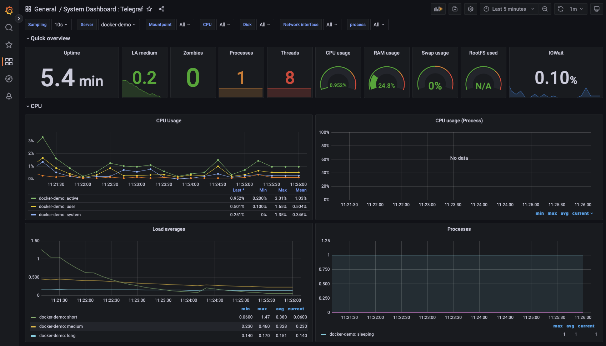
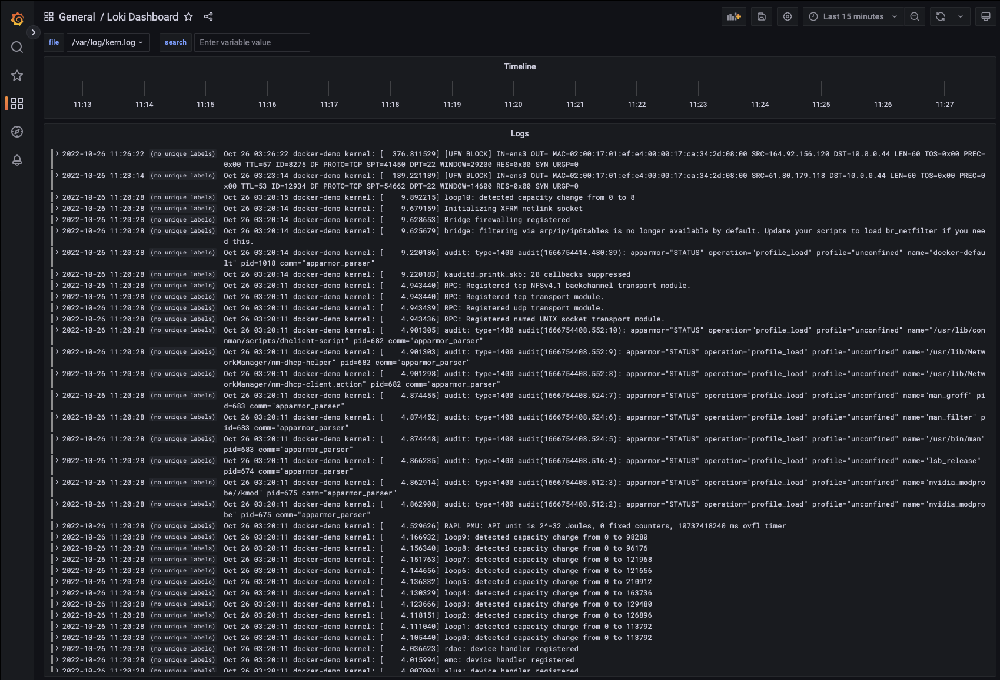

# Observability Stack
A Dockerized Grafana/Prometheus/Victoriametrics/Loki environment

- Ensure `docker` and `docker-compose` is installed and running (see https://docs.docker.com/get-docker/)
- Run `docker-compose up`
- Once instances are up you can connect to `http://localhost:3000` (or `http://<ip of server>:3000`)
- The default credentials are `admin`/`passw0rd`

``` sh
── Docker Containers
    ├── grafana
    ├── prometheus
    ├── victoriametrics
    ├── node-exporter
    ├── elasticsearch-exporter
    ├── loki
    ├── promtail
```

- VictoriaMetrics is an Open Source Time Series Database (see https://victoriametrics.com)

VictoriaMetrics and Prometheus write data to disk at roughly 2MB/s speed when collecting 280K samples per second. Prometheus generates more disk writes spikes with much higher values reaching 50MB/s, while the maximum disk write spike for VictoriaMetrics is 15MB/s. VictoriaMetrics needs up to 5x less RAM and 7x less disk space compared to Prometheus when scraping thousands of node_exporter targets. So you can use one of them.

- Telegraf is a server-based agent for collecting and sending all metrics and events from databases and systems. (see https://www.influxdata.com/time-series-platform/telegraf/)

You can use telegraf input plugins from here, https://github.com/influxdata/telegraf/tree/master/plugins/inputs

- Loki is a horizontally-scalable, highly-available, multi-tenant log aggregation system. It is designed to be very cost effective and easy to operate. It does not index the contents of the logs, but rather a set of labels for each log stream. (see https://github.com/grafana/loki)

## Screenshots



